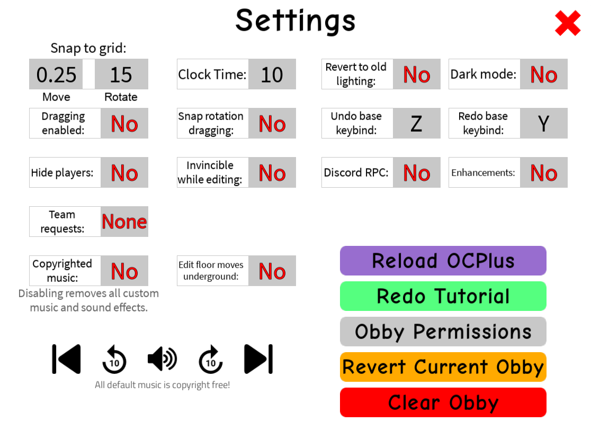
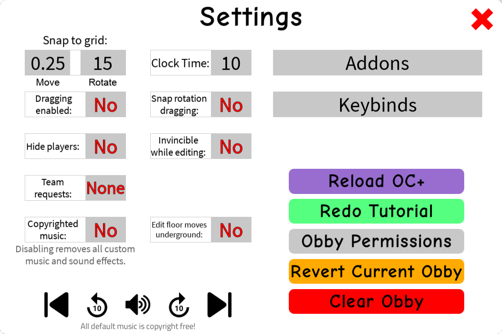
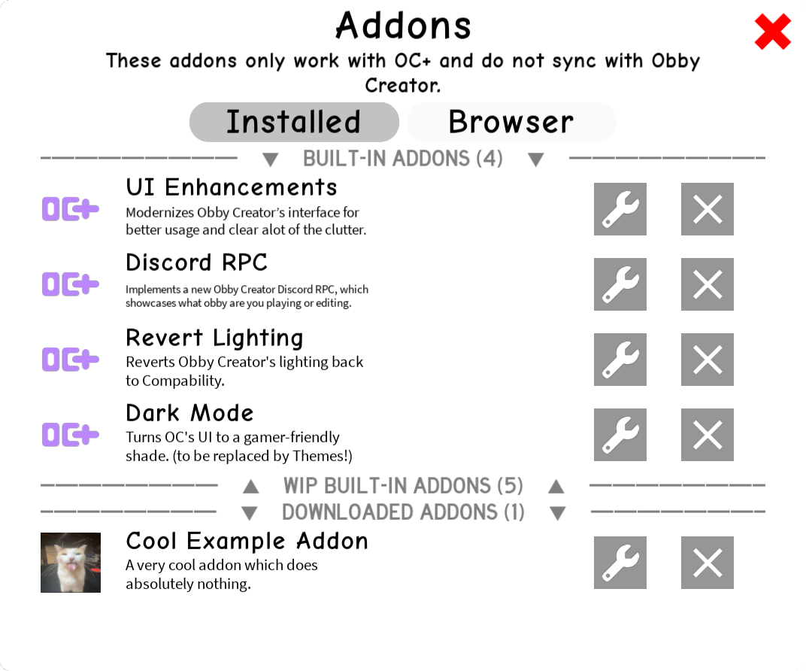

<h1 align="center"></h1>
<p align="center">


<a href="https://discord.gg/Mpw6b7vQfJ"></a>
</p>
<p align="center">OC+ is an enhancement script for Obby Creator that implements new features to the game in the form of Addons.</p>

## Usage
Loads the latest version of the script (v0.9):
```lua
-- Run this line of code to load OC+
loadstring(game:HttpGet("https://raw.githubusercontent.com/Gabe616/OCPlus/main/loader.lua"))()
```

## Compatibility

| Status            | Executor              | Reason/Issue                   |
| ----------------- | --------------------- | ------------------------------ |
| Not Yet Tested    | Hydrogen              |                                |
| Unknown           | Coco Z                | Keeps crashing                 |
| Working           | KRNL                  |                                |
| Working           | Fluxus                |                                |
| Working           | Fluxus Android        |                                |
| Working           | Kiwi X (EzExploits)   |                                |
| Working           | Script-Ware           | Unreleased |
| Working           | Synapse               | Unreleased |
| Not Working       | ~~Kiwi X (WRD)~~      | Throws "Fatal Error."          |
| Not Working       | ~~Oygen U~~           | Throws "Fatal Error."          |

## Frequently Asked Questions

### Will I get banned if I use OC+?

No! Mario118118 has allowed the usage of enhancement exploits in Obby Creator. Be weary you may get banned if you try to use enhancement exploits on other games like Blockate.

### How can I create my own Addon?

There's a [sweet API](https://github.com/Gabe616/OCPlus/tree/addons#readme) for making Addons just for you! Addons will be implemented in v0.9. As of now, there is no way to submit an Addon for OC+ yet.

### The script doesn’t work!

Check the compatibility table, is your executor not supported? If your executor isn't listed or the executor is marked as untested, help contribute by making an [issue](https://github.com/Gabe616/OCPlus/issues) and we'll add it to the readme.

## Screenshots

<br/>
<i>The Settings menu in version 0.3</i>
<br/>

<br/>
<i>The Settings menu in version 0.9</i>
<br/>

<br/>
<i>The Addons menu in version 0.9</i>
<br/>
<br/>

## Honorable Mentions
> **ImNotFireMan123** or **SometimesFire**
> 
> Designer of OC+, writer of this README

> **GABA8** or **Gabe616**
> 
> Developer of OC+
